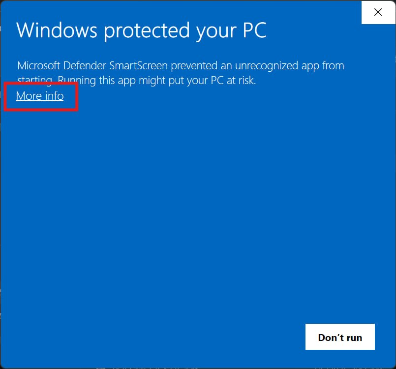
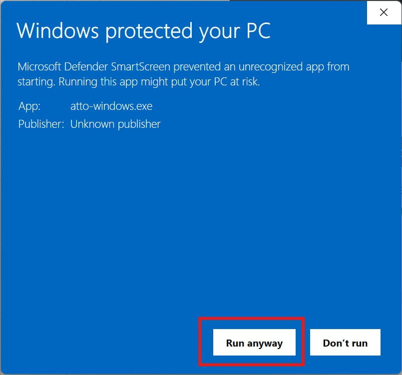

# Installation

We strongly recommend installing Atto with `pip` if you already have Python on your system. It is the simplest path, it is easier to update, and it avoids most of the operating system warnings that come with unsigned desktop builds.

The downloadable Windows, macOS, and Linux builds are provided for convenience, but Atto is not signed or notarized yet. Your operating system may warn you before opening it. Only continue if you downloaded Atto from the official website or the GitHub release page.

# Recommended: pip

Atto requires Python 3.11, 3.12, or 3.13.

On Windows, avoid Python 3.14 for now. Some of Atto's dependencies do not publish
Python 3.14 wheels yet, which can make `pip` try to compile native packages such
as `lxml` and ask for Microsoft C++ Build Tools.

```bash
# Install Atto
pip install atto-app
# Or if that fails, try
python -m pip install atto-app

# Launch Atto
atto
```

When Atto starts, it opens a terminal launcher and then opens the app in your browser automatically. Keep the terminal window open while using Atto. Closing the terminal closes the local app.

To update Atto later:

```bash
pip install --upgrade atto-app
# Or
python -m pip install --upgrade atto-app
```

<!-- Screenshot: pip install atto-app running successfully in a terminal. -->
<!-- Screenshot: Atto terminal launcher after startup, showing the app URL and "Do not close this window". -->

# Windows

Download `atto-windows.exe` from the Atto download page.

1. Open `atto-windows.exe`.
2. If Windows SmartScreen appears, click **More info**.
3. Click **Run anyway**.
4. Keep the terminal window open while using Atto.

Because Atto is not code-signed yet, Windows may show a warning before launching the app. This is expected for now.

<div align="center">
  <div style="display: inline-block; margin: 0 8px;">
    
    <p><strong>Step 2:</strong> Click More info</p>
  </div>
  <div style="display: inline-block; margin: 0 8px;">
    
    <p><strong>Step 3:</strong> Click Run anyway</p>
  </div>
</div>

# macOS

Download `atto-macos.dmg` from the Atto download page.

1. Open `atto-macos.dmg`.
2. Open `Atto.app`.
3. If macOS blocks the app, Control-click or right-click `Atto.app`, then choose
   **Open**.
4. If macOS still blocks it, open **System Settings** > **Privacy & Security**
   and allow Atto from there.
5. Keep the Terminal window open while using Atto.

The macOS build is not notarized yet, so Gatekeeper may warn you before opening it. The app opens through Terminal by design.

<!-- Screenshot: macOS DMG window showing Atto.app. -->
<!-- Screenshot: macOS Gatekeeper warning or Privacy & Security approval prompt. -->
<!-- Screenshot: macOS Terminal window after Atto starts. -->

# Linux

Download `atto-linux.tar.gz` from the Atto download page.

```bash
tar -xzf atto-linux.tar.gz
cd atto-linux
./install.sh
./Atto
```

The `install.sh` script installs a desktop launcher at `~/.local/share/applications/atto.desktop`. You can also run Atto directly with `./Atto`.

Keep the terminal window open while using Atto.

<!-- Screenshot: Extracted atto-linux folder showing Atto, install.sh, Atto.desktop, and atto.svg. -->
<!-- Screenshot: Linux terminal after running ./install.sh successfully. -->
