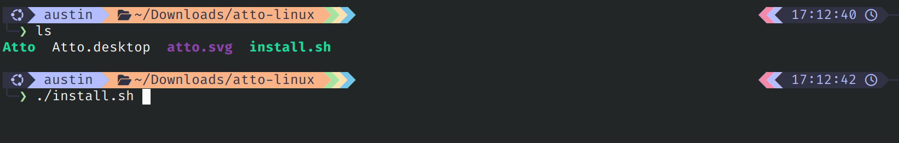

# Installation

We strongly recommend installing Atto with `pip` if you already have Python on your
system. It is the simplest path, it is easier to update, and it avoids most of the
operating system warnings that come with unsigned desktop builds.

The downloadable Windows and Linux builds are provided for convenience, but Atto is
not signed yet. Your operating system may warn you before opening it. Only continue
if you downloaded Atto from the official website or the GitHub release page.

Atto does not currently provide a macOS executable. On macOS, install Atto with
`pip`.

# Recommended: pip

Atto requires Python 3.11, 3.12, or 3.13.

```bash
# Install Atto
pip install atto-app
# Or if that fails, try
python -m pip install atto-app

# Launch Atto
atto
```

When Atto starts, it opens a terminal launcher and then opens the app in your browser automatically. Keep the terminal window open while using Atto. Closing the terminal closes the local app.

To update Atto later:

```bash
pip install --upgrade atto-app
# Or
python -m pip install --upgrade atto-app
```

# Windows

Download `atto-windows.exe` from the Atto download page.

1. Open `atto-windows.exe`.
2. If Windows SmartScreen appears, click **More info**.
3. Click **Run anyway**.
4. Keep the terminal window open while using Atto.

Because Atto is not code-signed yet, Windows may show a warning before launching the app. This is expected for now.

<div align="center">
  <div style="display: inline-block; margin: 0 8px;">
    
    <p><strong>Step 2:</strong> Click More info</p>
  </div>
  <div style="display: inline-block; margin: 0 8px;">
    
    <p><strong>Step 3:</strong> Click Run anyway</p>
  </div>
</div>

# macOS

Atto only supports `pip` installation on macOS right now. Follow the [recommended pip instructions](#recommended-pip).

# Linux

Download `atto-linux.tar.gz` from the Atto download page.

```bash
tar -xzf atto-linux.tar.gz
cd atto-linux
./install.sh
./Atto
```

The `install.sh` script installs a desktop launcher at `~/.local/share/applications/atto.desktop`. You can also run Atto directly with `./Atto`.

Keep the terminal window open while using Atto.

<div align="center">
  
  <p>Run the <strong>install.sh script</strong></p>
</div>
