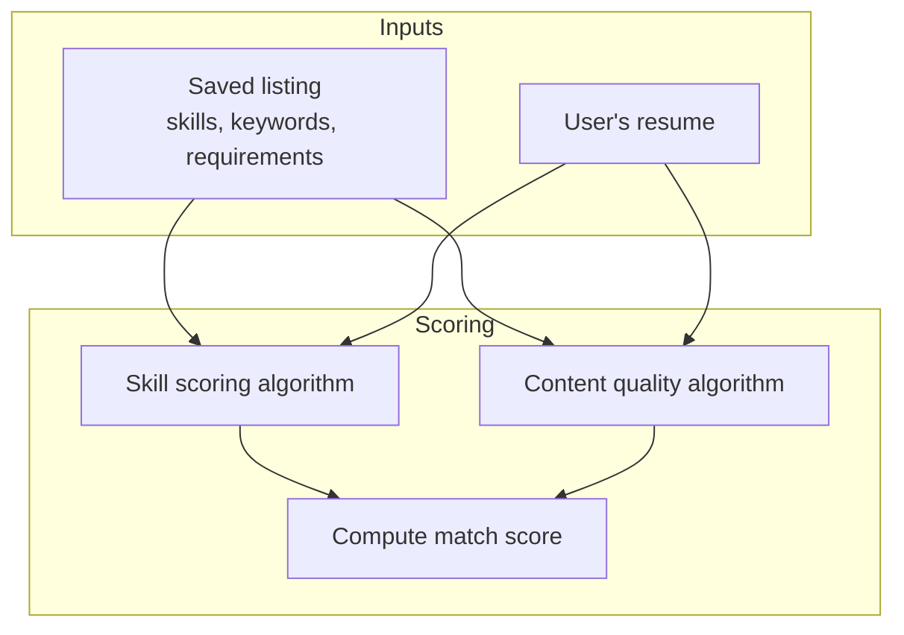
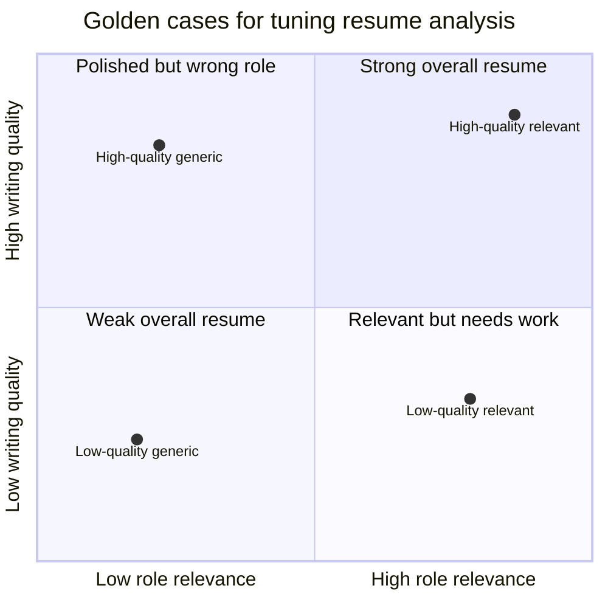

import AppScreenshot from '../../components/shared/AppScreenshot.astro';

## Why Resume Analysis Is Hard

Let me preface this by saying: I am not a recruiter, I don't have access to some secret sauce hiring formula, and Atto is not built around one either.

Instead, Atto's resume analysis system is built from a set of assumptions from recruiter advice, resume-writing advice, and common sense about how screening tends to work: match the role, use the right vocabulary, show evidence for important skills, make impact easy to find, use stronger verbs, avoid vague bullets, etc.

The basic principles are simple, but the details are not. How much should keywords matter? Do ATS systems consider semantic matches? How much does writing quality affect a recruiter's impression? There is no perfect answer there.

But that's also what makes this problem interesting. The goal is not to produce an oracle that decides whether someone deserves a job, but to give the user a useful read on how well their resume appears to match a specific listing, and then give feedback.

<AppScreenshot
  src="/blog/testing-attos-llm-resume-analysis/screenshot-breakdown.png"
  alt="Atto's resume analysis breakdown showing match score, skill comparison, content quality, and AI suggestions"
  caption="Atto's resume analysis view breaks the result into match score, skill comparison, content quality, and AI suggestions."
/>

## Designing Resume Scoring

Atto's application analysis is not one "ask the AI if this resume is good" call.

An LLM is a tempting shortcut here because it can read messy resumes and job descriptions. But real screening systems do not rely on one free-form model judgment, and Atto should not either, especially for match scores.

The pipeline is split into a few smaller parts:

- Skill scoring checks whether the resume shows evidence for the listing's important skills
- Content quality checks whether individual resume bullets are actually useful evidence
- Match score combines those signals to give a holistic read on how well the resume matches the listing

The scoring pipeline looks roughly like this:



### Skill Scoring

At this point, Atto already has structured listing data from the [listing pipeline](/blog/designing-and-testing-attos-listing-pipeline/). That includes extracted keywords for the role. Resume analysis reuses those keywords as the target set instead of asking the model to invent a new list from scratch.

For each keyword, the system asks two questions:

- How important is this term for the listing?
- How strongly does the resume show evidence for it?

This is where plain keyword matching starts to break down.

A listing might ask for "data ingestion workflows" while the resume talks about "ETL jobs" or "pipeline orchestration." Those are not identical strings, but they are related signals.

The opposite problem exists too. A resume that says "I invented Python" and a resume that says "I used Python in a school project" both contain the word Python, but you would be hard-pressed to find someone who wouldn't hire the inventor of Python.

All this to say that an LLM helps us understand semantic meaning.

The surrounding code still keeps it in a harness. The model scores a fixed keyword list and returns structured rows, so the result stays as a comparison table: listing importance versus resume evidence. It does not become a free-form paragraph about whether the resume "seems good."

### Content Quality

Skill coverage answers one question: does the resume have the right kind of evidence? Content quality answers another: where is the resume high signal, and where is it mostly noise?

Content quality is Atto's section-by-section assessment instead of one global score. Each resume unit is compared against the listing requirements and grouped into high-noise, low-noise, neutral, low-signal, and high-signal buckets. The result is a heat map of the resume's content quality.

That unit-by-unit shape is the important part. Instead of saying "your resume is 63% good", Atto can show which sections are carrying the match and which sections are probably worth editing. It also gives the suggestion system (we'll talk about that in a later section) a ranked list of weak units to target first.

<AppScreenshot
  src="/blog/testing-attos-llm-resume-analysis/screenshot-content-quality.png"
  alt="Atto showing section-level content quality highlights on a resume"
  caption="Green highlights mark higher-signal resume units for the listing, while red highlights mark lower-signal or noisier units to revisit."
/>

### Match Score

The final match score combines skill coverage and content quality, but it does not treat the resume as one flat bag of sentences.

The scoring split is roughly match score = 75% skill coverage + 25% content quality.

Skill coverage carries most of the score. Each keyword is weighted by its importance in the listing, so missing a critical requirement hurts more than missing a nice-to-have.

The more interesting part is content quality.

The first version simply averaged content quality across the entire resume. In practice, that was too harsh. Some sections like education and contact details are necessary but not strong evidence for whether someone matches a role. Yet resumes were penalized for having them.

So, the algorithm was revised to look at the strongest evidence units only instead of averaging every line equally. Supporting sections still show up in the content-quality breakdown, but the final score is driven more by the best role evidence.

Coincidentally, this also mimics how recruiters read resumes. They skim for the best evidence first, and are more likely to overlook weak sections if the strong sections already make a good case.

## AI Suggestions

Suggestions deserve their own section.

The interaction model is loosely inspired by PR comments on GitHub. The AI should point to a specific part of the resume, explain what is wrong, and suggest a change. Ideally it is more useful than a "LGTM", although I am still waiting for a model to leave that as the only resume review.

<AppScreenshot
  src="/blog/testing-attos-llm-resume-analysis/screenshot-ai-suggestions.png"
  alt="Atto showing a general AI suggestion and specific resume suggestions with a highlighted resume unit"
  caption="Atto gives one general suggestion plus targeted line-level suggestions. Hovering a suggestion highlights the relevant resume text in yellow."
/>

### Suggestion Budgeting

Initially, the match score was influenced by the number of suggestions. More suggestions meant a lower score. Intuitively, that makes sense, because more suggestions could indicate a weaker resume.

In practice, LLMs tend to be very talkative. If the prompt tells it to find fewer than 10 problems, it will find 9 problems, even if the resume is already good. This caused a blanket penalty that dragged down scores across the board.

So I flipped the relationship. Instead, the pipeline becomes:

1. Compute the match score from skills and content quality.
2. Use that score to decide the "suggestion budget".
3. Cap the number of suggestions generated by the LLM based on that budget.

As the match score rises, the available suggestion slots fall. A near-perfect resume should receive almost no coaching. A weak resume can receive more help.

A side effect of this is that the suggestions become more focused and helpful.

### Honest Suggestions

The hardest part of the feature is producing honest suggestions.

Testing exposed one failure mode pretty quickly: the model sometimes tried to make unrelated experience sound relevant by quietly changing what the candidate actually did.

```text
Original bullet:
Managed calendars, travel booking, and meeting logistics for a student organization.

Suggestion:
Reframe this bullet to emphasize data coordination, operational workflows, and cross-functional execution.

Replacement:
Coordinated data-driven scheduling workflows across student teams to improve operational execution and cross-functional efficiency.
```

The suggestion could technically work, but it's a bit of a stretch. Calendars and travel plans are a kind of scheduling workflow, sure. But "data-driven scheduling workflows" and "cross-functional efficiency" make the work sound much closer to operations analytics than the original evidence supports. I like to say the model is "laundering" the experience to make it seem more relevant.

Some prompt engineering helped. But the real fix was giving the model two clearer escape hatches.

First, broad role-fit gaps can go into the main summary instead of being forced onto a specific resume bullet. If the resume is missing Python API, SQL, or data pipeline evidence, the summary can just say that.

Second, we make it explicit that the model has `null` as an escape hatch if no useful replacement text can be generated without inventing new facts. Without it, the model feels pressured to always produce something, even when the honest answer is "I cannot rewrite this into relevant evidence without inventing something."

## Testing the Assumptions

The tests for this feature are less about proving that the model is deterministic, and more about checking whether the product assumptions behave the way I expect.

### The Testing Philosophy

This is a bad test:

```text
This resume should score exactly 82.
```

Let me be clear, it's an example of a bad test for an AI feature. For normal software, that's a perfectly fine test.

On the surface, it seems like a precise assertion, but it's a recipe for flaky tests and false negatives. When working with probabilistic LLMs, a prompt change or model update could shift the output.

The fact is, the number could shift to 80 or 85, and the product would still be working as intended. The more useful testing philosophy is to assert relative behavior:

```python
# Bad:
assert good_resume.match_score == 0.82

# Better:
assert good_resume.match_score >= 0.80
assert bad_resume.match_score <= 0.20
assert good_resume.match_score > bad_resume.match_score
```

As you can see, that does not mean the tests are only relative. The philosophy is a mix: use objective thresholds where the expected behavior is clear, and use comparisons where exact numbers would be fake precision.

The endpoints of the matrix have hard bounds: the best case should score at least `0.90`, and the weakest case should stay at or below `0.20`. The middle cases are where comparisons are more useful.

### The Four-Case Matrix

The golden dataset for testing Atto's resume analysis is not a random pile of fixtures. Instead, it is a matrix of synthetic resumes with controlled signals across two axes: writing quality and role relevance.

This produces four key test cases:

- High-quality relevant resume
- Low-quality relevant resume
- High-quality generic resume
- Low-quality generic resume

Easier visualized with a quadrant chart:



Each corner exists to catch a different failure: over-coaching an already strong resume, over-rewarding polished but irrelevant experience, rejecting relevant-but-rough evidence, or laundering a weak generic resume into fake role fit.

The nice thing about the matrix is that each comparison isolates one idea:

- Compare the two relevant resumes, and you are mostly testing writing quality.
- Compare the two high-quality resumes, and you are mostly testing role relevance.
- Compare the high-quality relevant resume against the low-quality generic resume, and you are testing the core match score logic.

That is much more useful than asserting one exact score.

### Judging Suggestions

Some quality questions are hard to express with normal assertions.

For example, a suggestion can be syntactically valid but still bad. It might be too vague, attach a broad role gap to the wrong resume unit, or sneak in facts the candidate never provided.

For that layer, Atto uses an LLM judge. The judge scores suggestions on dimensions like:

- Groundedness in the resume
- Groundedness in the listing
- Usefulness
- Specificity
- Honesty

This sounds great, but it has its own pitfalls. An interesting one I've encountered: the judge might grade the resume instead of the suggestion.

For example, if a resume has no backend experience, a good suggestion might say "this resume does not show backend API work." That is useful feedback, but the judge might give this a low score and say "the resume still does not demonstrate backend API experience."

That is grading the candidate, not the feedback. The suggestion correctly identified the gap, but is being penalized for it.

Clearing it up was just a matter of prompt engineering.

## A Short Conclusion

Building the resume analysis system was a fun challenge of reverse-engineering the signals that go into screening, and using a combination of deterministic methods and LLMs to surface those signals in a useful way.

Thanks for reading!
