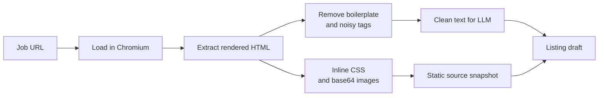
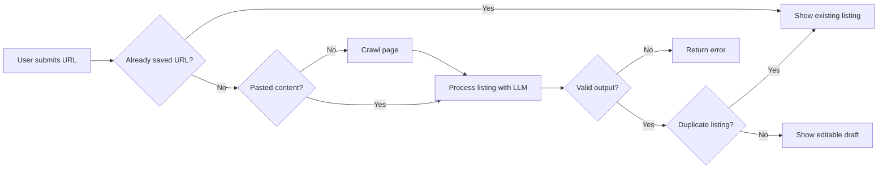
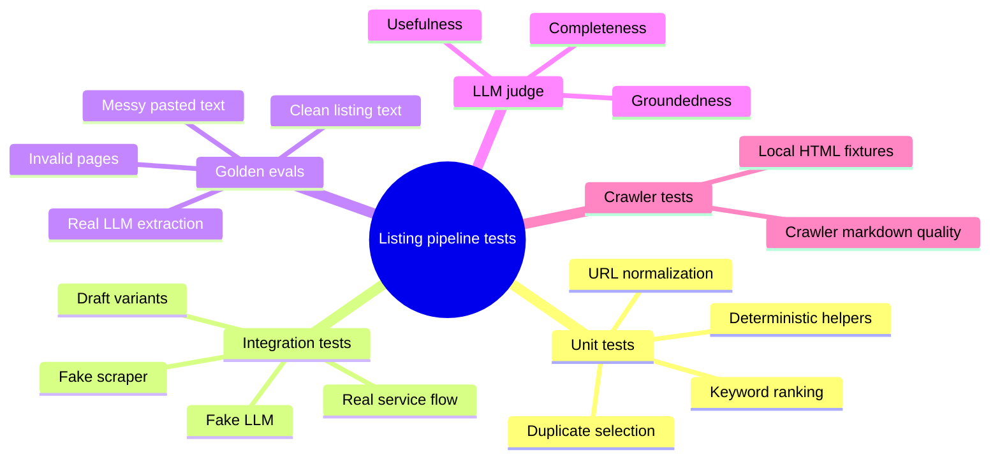
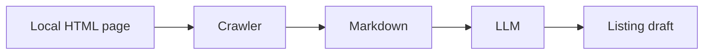

import AppScreenshot from '../../components/shared/AppScreenshot.astro';

## Why Listing Scraping Is Hard

Atto's listing pipeline sounds simple from the outside: give it a job listing URL, and it should create an editable listing for the user to review before saving. I'll refer to this editable listing as a "listing draft" for the rest of the post.

But the web is not a clean database. Job posts are spread across company career pages, job boards, and ATS systems. Some pages are server-rendered. Some are single-page applications (SPAs). Some show cookie overlays, login walls, navigation chrome, legal copy, recommended jobs, "apply now" forms, and generic company boilerplate before the useful listing content.

For Atto, the scraper needs to produce two things:

1. Text or Markdown that is clean enough for an LLM to extract information from
2. A screenshot that the user can inspect as the original source

If the scraper drops important content, the LLM extracts a weak draft. If it captures too much page chrome, the LLM has to dig for job information within surrounding noise.

<AppScreenshot
  src="/blog/designing-and-testing-attos-listing-pipeline/screenshot-new-listing.png"
  alt="Atto's new listing review screen with extracted listing fields and source reference"
  caption="Atto creates a reviewable listing draft first, so the user can inspect and edit the extracted fields before saving."
/>

## From Hand-Rolled Scraper to Crawl4AI

### The Early Days

The earliest version of Atto was still a TUI app, and the listing scraper was much simpler. It used normal HTTP requests and parsed whatever came back.

That worked for simple pages, but it was not enough for modern job sites. Many sites rely on client-side rendering or have anti-scraping measures that block non-browser user agents.

### Moving to Playwright

To overcome this, the next version moved to Playwright. That solved one problem: Atto could now load the page like a real browser. But the rest of the pipeline became very hand-rolled.



This implementation worked, but it was brittle and a nightmare to maintain. The worst parts were the asset conversion script and preprocessing rules. Every new site that had a slightly different structure or anti-scraping measure required a new edge case in the code.

Maintaining Atto became two responsibilities: building the product features, and playing whack-a-mole with the scraper.

> If you want to see the old shape, the repo state is at [2d1f8af](https://github.com/AustinKong/atto/blob/2d1f8afb72b1c8e1085499632128484ad628375f/backend/app/services/scraping_service.py).

### Why Crawl4AI Fit Better

The turning point came while building Atto's listing research feature.

Listing draft generation only needs to scrape one URL. Listing research is broader. It needs to search the web, crawl relevant pages, summarize company context, estimate salary signals, and gather market information around a role.

That's when I discovered Crawl4AI. The library already handled the parts I did not want Atto to own forever: browser-based crawling, screenshot capture, HTML-to-markdown conversion, content filtering, robots.txt handling, deep crawling, iframes, and other browser weirdness.

The main attraction, though, was the abstraction it provided.

> The HTML-to-markdown conversion is especially useful. Raw HTML is noisy and full of structure that is useful to browsers, but devours the context window in an extraction prompt. Markdown gives the LLM a cleaner reading surface while preserving headings, sections, and lists well.

The single-listing path is still simple from the caller's perspective: give the scraper a URL, and get back crawled content plus an optional screenshot.

Internally, the crawler is configured for the kind of pages Atto cares about. It scans the full page, removes overlay elements, processes iframes, prunes low-value content, ignores images and links in the extracted markdown, and can respect robots.txt depending on the user's configured mode.

## The Listing Draft Flow

Enough with the scraper tangent. Let's talk about the main listing draft flow.

The full flow is more interesting because the order of operations matters. Atto tries to avoid expensive work whenever possible, and it keeps the deterministic product decisions outside the LLM call.



That diagram hides a lot of detail, but the next sections explain the interesting parts.

### URL Normalization

The first important bit is that "already saved URL?" does not mean a naive string comparison.

Users paste messy URLs. Job boards add tracking parameters. Some links use `http`, some use `https`, some include `www`, some include fragments, and some carry query parameters that do not change the actual listing.

So Atto normalizes the URL before checking for duplicates. The normalizer applies a set of rules to convert URLs to a standard format. For example:

```text
Input:
HTTP://www.careers.example-company.com:80/jobs/./software-engineer/../software-engineer/?utm_source=linkedin&ref=feed&location=sg&id=123#apply

Output:
https://careers.example-company.com/jobs/software-engineer?id=123&location=sg
```

### Pasted Content as an Escape Hatch

We also give the user the option to paste content instead of relying on the scraper. If they do, Atto skips crawling completely and sends that pasted text into extraction.

That matters because some job sites block crawlers, require login, or show the useful content only after a user-specific interaction. Pasted content is the escape hatch for cases where crawling fails.

<AppScreenshot
  src="/blog/designing-and-testing-attos-listing-pipeline/screenshot-paste-content.png"
  alt="Atto's pasted content input for manually adding a job listing"
  caption="Pasted content skips crawling entirely, which keeps blocked or login-only job pages usable."
/>

### Validating and Cleaning the Extracted Listing

Another important step is validating the LLM output before it becomes a listing draft.

First, the LLM response has to fit the shape Atto expects. It needs enough structured data to become a real listing: company, title, description, requirements, skills, and the other fields the app uses. If that shape is incomplete, Atto treats it as a failed draft instead of pretending the extraction worked.

Second, Atto uses the LLM to check whether the crawler actually sent a useful page. Sometimes the crawler succeeds technically, but the page is not a job listing. It might be an application form, a login wall, or just a generic company page. In that case, the extraction can explicitly say: this is not a valid listing, and Atto can ask the user to paste the content instead.

### Duplicate Detection

There are two duplicate paths in Atto:

- Exact (normalized) URL duplicate
- Content duplicate

The exact URL case is cheap and decisive. Normalize the URL, check whether it already exists, and stop before touching the crawler or the LLM.

<AppScreenshot
  src="/blog/designing-and-testing-attos-listing-pipeline/screenshot-duplicate-alert.png"
  alt="Atto showing a duplicate URL alert for a job listing that was already saved"
  caption="The database doesn't really implode, I was just bored when writing that error message."
/>

Content duplicates are harder. The same role can appear at multiple URLs: a company careers page, LinkedIn, Greenhouse, Lever, a recruiter mirror, or a copied listing in a job board. URL matching will miss those.

So Atto checks content similarity only after extraction. By then, it has a listing-shaped candidate with the company, title, description, skills, and requirements. That lets the duplicate detector compare something closer to the product object, not just a blob of scraped text.

The check combines two signals:

- Semantic similarity from the stored listing content
- Heuristic matching on fields like company and title

That split is useful because neither signal is perfect. Semantic search is good at catching re-posted or lightly rewritten listings. Heuristics are good at catching obvious same-company, same-title cases without overthinking them.

Many companies publish similar roles. "Backend Engineer" at one company can look a lot like "Backend Engineer" at another company. They may both mention APIs, distributed systems, databases, and cloud infrastructure.

From a candidate's perspective, those are not duplicates. They are separate opportunities.

So there is a final company guard: even if two roles are semantically and heuristically similar, they are not duplicates if the companies do not match. This has worked pretty well in practice.

## Testing the Pipeline

The hard part about testing this feature is that two important dependencies are not really deterministic:

- Web pages
- LLM output

Pages change, crawl results change, and LLMs can produce wildly different answers even at temperature 0 (you'd be surprised!) So the tests cannot be built around the fantasy that the whole pipeline is deterministic. Instead, the test suite splits the problem into layers.



The three main layers are:

1. Unit tests for deterministic code
2. Integration tests for the service flow, with fakes at the unstable boundaries (scraper and LLM)
3. Golden evals for the LLM-facing behavior, with real LLM calls

This lets us isolate the non-determinism to the layers that need it, while keeping the rest of the tests precise and actionable.

### Golden Tests

Atto uses golden cases to evaluate the listing pipeline.

The current set is minimal for now:

- A clean software engineering listing
- A messy pasted copy of the same listing (with extra boilerplate and navigation text)
- A student internship listing
- A listing with an explicit salary range
- An invalid application-form page that mentions a role but does not contain the job details

> Future cases could expand into adjacent industries outside tech to test robustness. That is probably useful, but it also needs more domain expertise than I currently have as a programmer. A good finance, healthcare, or operations fixture should reflect how those listings actually describe work, not just be a tech job with the nouns swapped.

The golden tests avoid exact-output assertions wherever multiple good answers are possible. The broad expectations are:

- Valid listing inputs should produce editable drafts
- Clean and messy versions of the same listing should preserve the same identity
- Invalid application forms should return an error instead of a fabricated draft

For identity fields, the tests can be fairly strict. A draft should preserve the company, role family, location, domain shape, and salary when those are clearly present.

For skills, keywords and requirements, the tests need more tolerance. Even with temperature 0, the LLM can produce different reasonable keyword lists. One run might prioritize a programming language. Another might prioritize a domain term or product term. Requiring the exact same ten keywords would make the test suite look precise while testing the wrong thing.

So the tests stay intentionally loose. They check general behavior, not exact wording:

- Extracted skills overlap with expected candidate-actionable concepts
- Requirements are sentence-like rather than bare nouns
- Keywords are short and source-backed

That catches the failures that matter without requiring the LLM to write the same sentence every time.

### Using an LLM Judge

Some quality questions are hard to express with normal assertions.

For example, a listing description can be technically non-empty but still useless. It might repeat generic company boilerplate instead of describing the actual role. A draft can pass basic field checks while still feeling vague to a candidate.

For that layer, Atto uses an LLM judge. The judge scores the generated draft on dimensions like:

- Groundedness
- Description specificity
- Qualification coverage
- Responsibility coverage
- Boilerplate avoidance
- Usefulness to a candidate

The normal assertions check things the software can know precisely. The judge checks whether the draft is actually useful as a job listing draft.

### Keeping Crawler Tests Separate From LLM Evals

One tempting test would be a full end-to-end eval:



That looks realistic, but it is a bad primary diagnostic tool. If it fails, the failure is ambiguous:

- Did the crawler drop important content?
- Did the prompt fail despite good source text?
- Did the LLM produce an acceptable answer that the assertions rejected?

So Atto keeps the layers separate.

The LLM eval should start from known source text and evaluate extraction quality. The crawler test should serve local HTML and evaluate whether the crawler produces useful markdown.

## The Bottom Line

This system is still not perfect.

The crawler will miss pages. The LLM will occasionally extract something weird. The golden cases will need to grow as I find more real-world listing shapes.

But that is also why the product has escape hatches. If crawling fails, the user can paste the listing content manually. If extraction is imperfect, the user can edit the draft before saving it.

That makes the feature much less brittle. It does not need to be magic. It just needs to be useful, inspectable, and easy to keep tuning.
