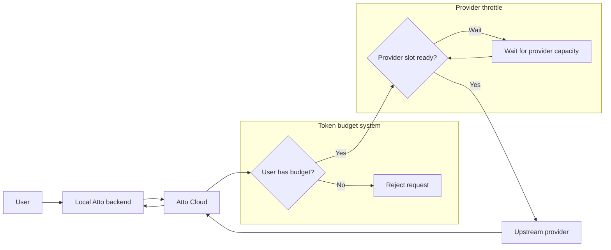
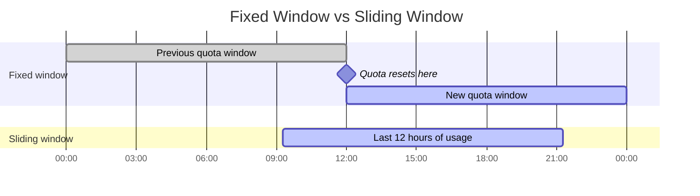
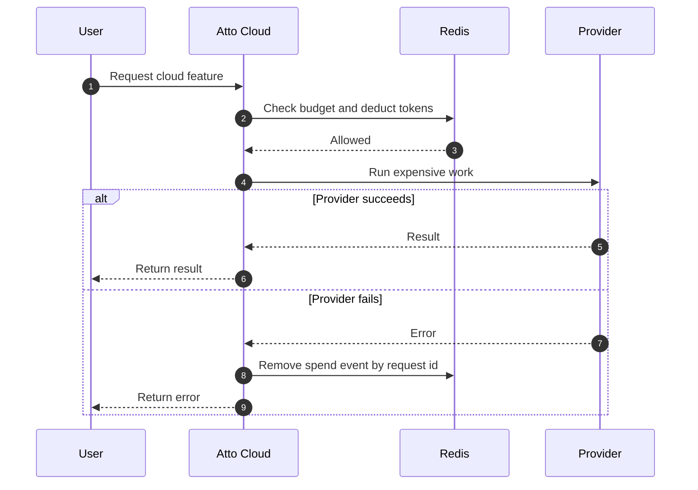
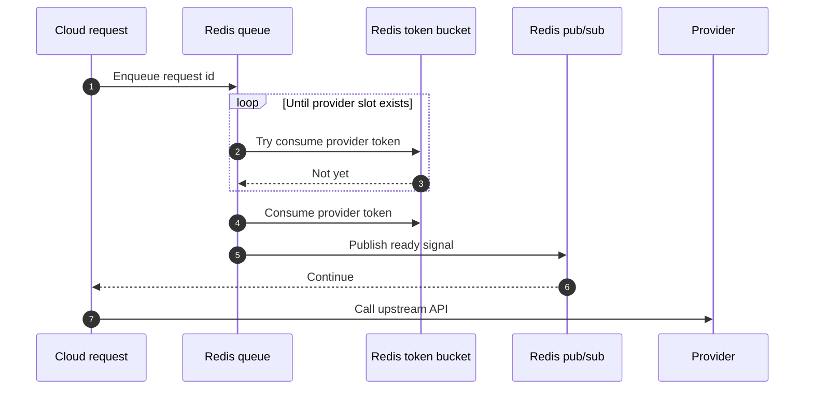

## Why Atto Cloud Needed Usage Limits

Atto is local-first by default.

That was an explicit product choice, not just an implementation detail. Job search data can get pretty personal, so I did not want the core product to require a hosted SaaS account just to be useful.

But local-first has one obvious onboarding problem: keys.

Some of Atto's most useful features depend on external services: model calls, embeddings, company research, salary data, job listing extraction, and provider-backed enrichment. I can ask a developer to bring their own API keys. I can't expect every Tom, Dick, and Harry to create accounts for every provider needed, before they even get value out of the product. That's just bad UX!

So Atto Cloud was meant to offer a managed experience without removing the local-first path. Privacy-conscious users could still run locally and bring their own keys, while users who just wanted the product to work could let Atto Cloud handle the provider integrations.

Once Atto Cloud is paying for expensive work on behalf of users, the next question becomes:

> How do you make sure usage stays bounded?

### Two Different Limits

The system needed two layers:

- A user budget: how much Atto Cloud work is this user allowed to consume?
- A provider throttle: how quickly should Atto call model providers, salary APIs, market APIs, and other upstream services?

Those sound similar, but they solve different problems.

The user budget protects Atto's cost model. The provider throttle protects Atto's relationship with upstream APIs.



## The Token Budget

The naive design is to simply limit requests. It would be something like: every user gets 100 cloud requests per month.

That is simple, but it is also a little dishonest because not every request is the same. An embedding request is not equivalent to a full market-context research request. A cheap lookup and a multi-step AI workflow should not consume the same amount of budget just because both happen to be one HTTP request.

So Atto Cloud uses a shared token budget instead.

Each endpoint declares a cost. Cheaper endpoints consume fewer tokens, heavier endpoints consume more. From the user's perspective, this still behaves like one budget pool, but internally the system can account for the fact that some operations are more expensive than others.

### Costs Live at the Route Boundary

In FastAPI, this sits naturally in route dependencies. It's basically per-route middleware enforcement.

For example, a protected route can declare:

```python
@router.post(
  '/structured',
  response_model=dict[str, Any],
  dependencies=[Depends(require_tokens(cost=8))],
)
async def call_structured(...) -> dict[str, Any]:
  ...
```

So the route reads as: this operation costs 8 tokens.

The handler itself does not need to know how budgets are stored, how access is checked, or how refunds work. It just does the business logic.

### The Race Condition

The obvious budget system is:

1. Read the user's remaining budget.
2. Check whether the request can be fulfilled.
3. Update the remaining budget.
4. Run the expensive operation.

Conceptually, that sounds fine.

But Atto Cloud avoids modelling usage as a single "budget left" counter. It stores spend events instead.

That inversion is useful for two reasons. First, the current usage can be derived by summing recent spend events. Second, each spend event becomes an audit trail: when did this spend happen, how much did it cost, and which request created it?

Both these systems still face the same problem: they break as soon as requests overlap. Two requests can read the same remaining budget, both decide they can proceed, and both deduct from a stale view of the world.

The core requirement is thus: checking whether the request fits and recording the spend event must happen atomically.

### Redis as the Budget Ledger

Redis was a good fit here because the budget state is hot-path, small, and naturally time-bound.

Atto Cloud stores user spend events in Redis rather than treating the primary database as the real-time usage ledger. Each user has a budget key, and each spend event records when it happened, how much it cost, and which request created it.

We use a sliding window log algorithm. Instead of a naive fixed window, the system stores individual spend events and calculates usage over the most recent window.

The reason for choosing a sliding window is easier to see visually:



A fixed window has a hard reset boundary. A sliding window log follows recent usage instead. Redis sorted sets fit that model nicely because the score is the event timestamp, so expired events can be removed by score and current-window events can be summed.

The actual deduction logic runs inside a Redis Lua script. The script removes expired events, calculates current usage, and adds the new spend event only if it fits. Redis executes that script atomically, so another request cannot slip between the check and the deduction.

### Refund-on-Error

Deducting first solves the concurrency problem, but it creates a fairness problem.

If Atto reserves tokens, calls a provider, and the provider fails, the user should not lose budget for work that never produced a result.

So every spend event includes a request id. The dependency deducts tokens before the expensive operation, and if the route raises after deduction, it removes the spend event for that request id.



That gives the system the shape it needs: reserve budget before the provider call so concurrent requests cannot overspend, then remove that reservation if the operation fails.

## Provider Throttling

The user token budget protects Atto from unbounded user consumption. It does not, by itself, protect Atto from upstream provider limits.

Even if every user is within budget, a spike of valid requests can still make Atto call upstream APIs too quickly. That is how you get throttled or blacklisted by the services your product depends on.

So provider clients need their own throttle layer.

### The Distributed Version

I landed on a Redis-backed distributed throttler implementation.

If Atto Cloud ever ran more than one instance, a normal in-process limiter would not be enough. Each instance would only know about its own requests, so three pods could accidentally triple the real request rate against the same upstream API.

The distributed throttler avoids that by making Redis the shared coordination point.

Provider clients push request IDs into a Redis queue. A throttler loop pops from that queue, waits until the provider-level token bucket has capacity, and then publishes a readiness signal back to the waiting request.

The assumption is that multiple Atto Cloud pods share the same Redis instance. That gives all pods one shared view of provider capacity instead of letting each pod enforce its own local limit independently.



The queue also changes the user experience. A request that is within the user's budget does not have to be rejected just because the provider is temporarily saturated. It can wait for capacity, continue once the throttler publishes a ready signal, and only fail if it times out.

### The Version Atto Actually Used

For the active cloud code, I kept it simpler.

The provider clients use an in-process token bucket through `aiolimiter`. Each provider declares a bucket capacity and refill rate, and public provider methods are wrapped with a `@throttled` decorator.

That is enough when the cloud service is running as a single instance.

The Redis-backed throttler stayed as a KIV (Keep In View) implementation for the future. If Atto Cloud needed to scale horizontally, that would be the point where the distributed version starts to make sense.

This ended up being the right call.

Atto Cloud was eventually put on hold, so not shipping the distributed throttler saved complexity that the product never actually needed. It is a nice example of KISS working out in practice: design the bigger system clearly enough that you know where it would go, but only activate it when the product shape demands it.

## The Bigger Picture: Why Cloud Was Paused

The cloud design made sense, but the timing did not.

The local app was still the core product, and shipping cloud infrastructure would have added operational weight before the product really needed it. Atto Cloud was not just "some endpoints." It meant provider credentials, usage limits, provider failures, observability, support, abuse handling, and all the boring-but-important work around running a service.

There was also a practical constraint: I couldn't run a SaaS business on my student visa. (LOL)

But even though Atto Cloud is not active right now, I still thought the usage-limit system was an interesting case study, and that's why we're here. (Thanks for reading BTW!)
