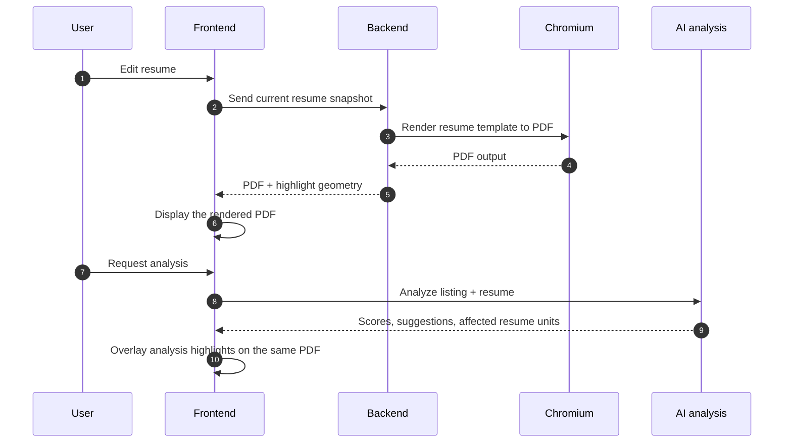
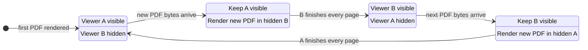
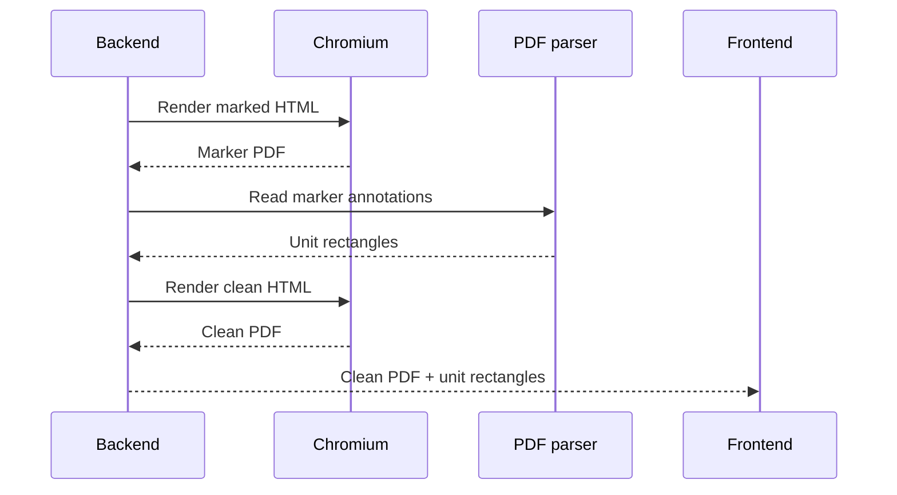

import AppScreenshot from '../../components/shared/AppScreenshot.astro';

## System Requirements and Tradeoffs

The PDF system is basically the core of Atto.

It powers the live resume preview, generates the final resume PDF, and also handles all the AI feedback overlays and highlights. So this is not one of those backend systems users never notice. If the renderer feels bad, the whole app feels bad.

For resume builders especially, rendering consistency matters more than most people expect. Nobody wants to spend time tweaking spacing and trimming lines just for the exported PDF to suddenly spill onto a second page.

That mismatch between preview and export is one of my biggest gripes with platforms like VMock. The preview says one thing, the exported PDF says another, and suddenly your 1-page resume becomes 2 pages.

### The Requirements Laid Out

The main requirement was pretty simple:

> If the preview shows one page, the exported PDF must also be one page.

The preview system also needed to:

- Update in near real time while editing
- Export a 1:1 submission-ready PDF
- Support AI overlays and highlight geometry directly on top of the rendered document

And it had to do all of that without feeling unstable.

I say *near* real time because the current pipeline is intentionally debounced by two seconds. Rendering PDFs through Chromium is expensive, especially when every edit potentially changes layout.

Another important constraint was that preview and export could not be separate rendering systems.

The moment those diverge, even slightly, the editing experience starts to break down. You adjust spacing in the preview, export the PDF, and suddenly line wrapping changes or an extra page appears.

### Choosing a Rendering Setup

Originally, I tried rendering the preview directly as HTML.

Which sounds like the obvious thing to do. The templates already existed as HTML/CSS, so why not render them directly in the frontend and only generate PDFs during export? You get instant preview updates (rendering HTML is cheap) without rebuilding a PDF on each update.

Turns out its not that simple. HTML and PDFs rarely behave identically, tiny things will start to drift: spacing, line wrapping, page breaks, font rendering, overflow behaviour etc. The preview might look correct while the exported PDF pushes a section onto page two.

This is also why we didn't go with a traditional *WYSIWYG* (What You See Is What You Get) editor. Because WYS is not always WYG when exporting to PDF.

Instead of treating the HTML preview as the source of truth, I made the rendered PDF itself the source of truth. The preview is literally a rendered PDF.

Yes, it's heavier, and yes, it's slower. But users see exactly what they actually export, and for resumes that tradeoff is worth it.

### Why Playwright + Chromium

PDF generation runs through Playwright + Chromium.

Could a lighter rendering stack work? Probably. But Chromium already solves most of the difficult layout problems for us.

Resume templates are already HTML/CSS documents, so letting Chromium handle layout was much simpler than fighting a separate PDF rendering engine.

There was also an infrastructure advantage. Atto already uses Playwright + Chromium elsewhere in the stack through crawl4ai, so the rendering environment already existed. Which means we are getting two for the price of one!

In practice, it gives us a good tradeoff:

- Stable rendering
- One shared rendering environment
- No frontend-only PDF engine to maintain
- Minimal additional infrastructure complexity

### High-Level Rendering Flow



The editing experience is heavily inspired by dual-pane tools like Overleaf. The user edits content on one side while the rendered output updates on the other. The key difference is that the preview is not HTML — it is the actual rendered PDF.

<AppScreenshot
  src="/blog/inside-attos-pdf-rendering-pipeline/screenshot-dual-pane.png"
  alt="Atto's resume editor with form fields on the left and a rendered PDF preview on the right"
  caption="The editor and rendered PDF preview sit side by side so layout decisions happen against the final artifact."
/>

Another architectural decision was moving rendering entirely into the backend.

Atto is a desktop application, so frontend-to-backend latency is not the bottleneck. The expensive step is Chromium rendering itself.

And once a backend renderer already exists for export generation, centralizing the entire PDF pipeline there simplifies the architecture considerably.

## The Swap Buffering System

The first version of the preview used a single PDF viewer.

Whenever new PDF bytes arrived from the backend, the frontend simply replaced the existing document:

```js
setPdf(newPdfBytes)
```

Conceptually, that sounds simple. In practice, PDF rendering behaves very differently from normal DOM rendering.

The old viewer disappears, the new one starts loading, pages start rendering progressively, and suddenly the user sees all the ugly intermediate states: blanking, flicker, page pop-in, loader flashes.

The preview basically kept flickering whenever you edited something. So eventually I scrapped that approach and moved to a swap buffering system.

### How it Works

The inspiration actually came from double buffering techniques used in graphics/rendering systems. The basic idea there is also the same: prepare the next frame in the background first, then swap it in once it is ready instead of rendering directly onto the visible frame.

Similarly, instead of one PDF viewer, keep two document instances mounted at all times. One visible, one hidden.

When new PDF bytes arrive, the hidden viewer gets updated first. It loads and renders everything in the background. Only after it is fully ready do we swap which viewer is visible.



This works because hiding and showing a viewer (with CSS) is cheap, while actually creating and rendering a PDF viewer is the expensive part. So all the heavy work happens off-screen before the user ever sees the next frame.

One important detail is that the viewers are never destroyed and recreated between renders. Both stay mounted permanently: one sits in front while the other renders in the background. Once the hidden viewer finishes rendering, visibility flips.

That means the preview never has to fall back to an empty loading state while waiting for the next render.

### Readiness is Not Just "Did the PDF Load"

One subtle issue with PDF rendering is that a document being loaded does not necessarily mean it is visually ready. A document can finish parsing while individual pages are still rendering progressively in the background.

If the swap happens immediately after the load event, users still see incomplete renders:

- Page 1 appears
- Page 2 pops in later
- Page 3 appears after that

To avoid that, the renderer tracks `expectedPages` and `renderedPages`. Each completed page increments `renderedPages`. Only once `renderedPages >= expectedPages` does the viewers swap.

### Performance Tradeoff vs. UX

This architecture is definitely heavier than a single-viewer approach.

There are:

- Two mounted document instances
- More state coordination
- Higher memory usage

But the UX difference is substantial. Trading a bit of complexity for a preview that feels stable and trustworthy was an easy decision.

## The Highlighting System

The other big thing the preview needed to support was highlighting. Not just simple text selection, but semantic relationships like:

- “This AI suggestion refers to this exact resume bullet”
- “This section contains weak content”
- “Highlight the affected section while hovering a suggestion”

That sounds simple, but it is one of the problems that came along with switching the preview to PDF.

With an HTML preview, the frontend could simply target DOM nodes and attach classes.

A PDF viewer does not expose that level of control. By the time the document reaches the screen, the original HTML structure has been flattened into canvases, text layers, annotations, and internal rendering abstractions.

My first instinct was to use the PDF viewer's own highlighting behaviour. That did not work very well. It was finicky, and text-based highlighting has a lot of edge cases: repeated phrases, capitalization differences, line wrapping, text split across pages, formatting differences etc.

Once the resume becomes a PDF, the frontend no longer owns the underlying structure. It only has access to rendered pages.

### The Core Problem

The question becomes:

> How do you determine where a specific resume field ended up inside the final PDF?

For example, the AI system might say: "Improve this bullet point". But the PDF viewer knows nothing about resume bullets. It only understands pages, coordinates, annotations, and rendered text.

Stable unit IDs were introduced to solve this problem. Every meaningful piece of content gets a UUID:

- Text units
- Dates
- Titles
- Bullets

A “unit” becomes the smallest highlightable entity in the system.

Instead of AI suggestions pointing to raw strings, they point to unit IDs. The renderer can then map those IDs back to real PDF coordinates.

One tradeoff is that highlights operate at the unit level rather than the individual word level. For Atto’s use case, that is completely fine. Most feedback concerns bullets, sections, dates, or titles rather than one random word in the middle of a sentence.

### Rendering Once for Geometry, Once for Display

The backend renders the document twice.

The first render is a measurement pass. During this pass, every highlightable unit is wrapped in an invisible marker link:

```html
<a href="atto-resume-unit:{unitId}">...</a>
```

The links are intentionally styled to look visually identical to normal text. That detail matters because any layout shift during measurement would invalidate the geometry.

Chromium preserves those links as PDF annotations during rendering.

After generation, the backend parses the PDF using `pypdf`, scans the annotations, and extracts the bounding rectangles for every `atto-resume-unit:` marker.

The mapping pipeline becomes:

```text
unit UUID -> PDF annotation -> PDF rectangle
```

After extracting geometry, the backend performs a second clean render without the marker links. That clean version becomes the actual export artifact.

The final response (returned by the endpoint) looks roughly like this:

```ts
{
  pdfBase64: string
  geometry: Record<unitId, Rect[]>
}
```

The PDF is the rendered artifact. The geometry map is the bridge back to the structured content model.



This approach keeps the geometry extraction tied to the same rendering path that produces the final PDF. Chromium performs layout, and the system simply asks the resulting PDF where the marked content ended up.

### Normalized Coordinates

The backend does not send raw PDF coordinates directly to the frontend.

PDF coordinate systems are awkward:

- Origins differ from browser coordinates
- Page dimensions vary
- Viewer zoom changes rendering scale

Instead, rectangles are normalized before being returned:

```ts
{
  pageIndex: number
  x: number
  y: number
  width: number
  height: number
}
```

All positional values are expressed between `0` and `1`, which makes frontend rendering significantly simpler. A rectangle positioned 20% from the left and 40% from the top remains correct regardless of zoom level, display size, or page scaling.

Geometry for a unit is also stored as an array of rectangles rather than a single bounding box, because text can wrap across multiple lines. Using one large rectangle would highlight the empty space between wrapped lines, which looks visually awkward. Rendering one rectangle per line produces a much cleaner result.

### Drawing the Highlights

On the frontend, highlight rendering is intentionally simple.

The preview already has the geometry map, so when the user hovers an AI suggestion, the frontend just looks up the corresponding unit ID and draws overlay rectangles on top of the rendered PDF.

<AppScreenshot
  src="/blog/inside-attos-pdf-rendering-pipeline/screenshot-highlights.png"
  alt="Atto showing AI suggestion highlights over the rendered resume PDF"
  caption="Highlights are drawn from normalized PDF geometry, so AI feedback can point at the exact rendered resume units."
/>

The nice part is that the highlight system never needs access to the actual text itself. The AI system, the resume editor, and the PDF viewer all communicate through the same stable unit IDs.

Highlights are also separated into "layers" with individual layer keys to ensure semantically different highlights don't overwrite one another.

## The Bottom Line

None of this is the lightest possible setup.

Rendering PDFs through Chromium is expensive, the pipeline is more complex than a normal HTML preview, and the highlighting system adds a second rendering pass.

But for resume builders, consistency matters more than raw rendering speed. If users are going to spend hours tweaking layout, the preview has to be trustworthy.

That tradeoff ended up shaping almost every part of the pipeline.
